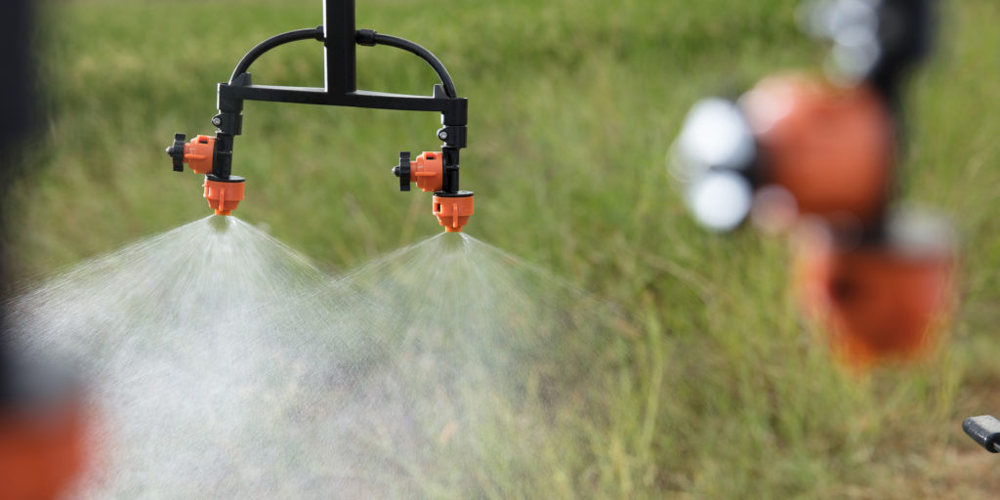
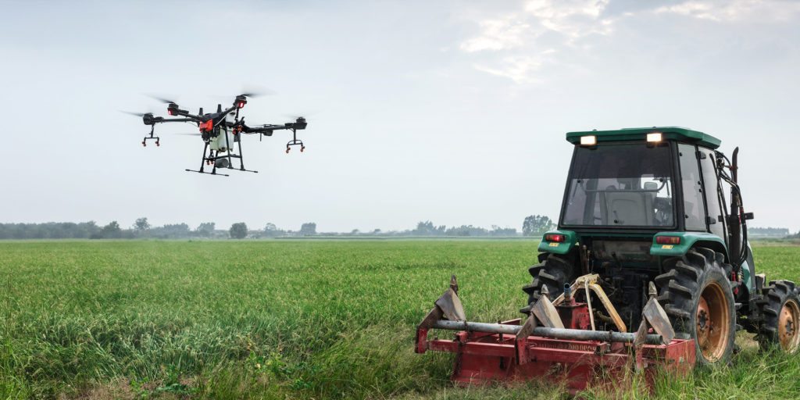
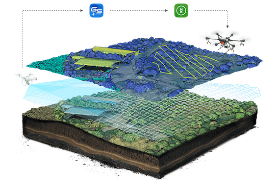
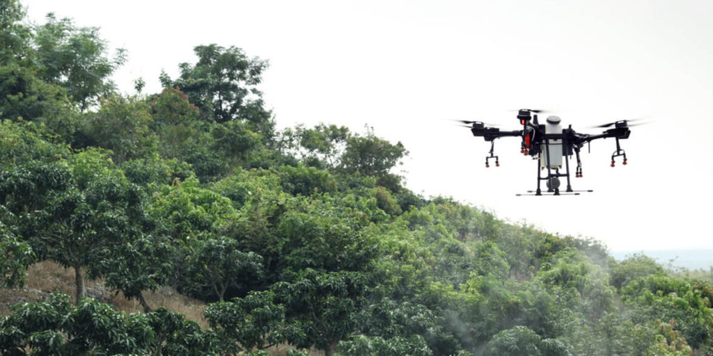

import { Link } from "gatsby"

Temel tarımsal işlemler için optimize edilmiş güç söz konusu olduğunda, DJI Agras T16'dan daha iyi bir seçenek yoktur. Sağlam modüler tasarımı, 16 litrelik deposu ve inanılmaz 3D planlama sayesinde Agras T16, operasyonel verimliliği önemli ölçüde artırdı.

Günümüzde çiftçiler, ilaçlama veya ekim sırasında verimliliklerini en üst düzeye çıkarmak için yeni teknoloji biçimlerini kullanmaya açıklar. DJI’nin Agras T16 gibi tarımsal çözümleri onlara tam da bunu yapmak için ihtiyaç duydukları araçları sağlıyor. Tarım dünyasında gelişmek ne kadar zor olsa da, tarımsal dronlar, çiftçinin sektörün ihtiyaçlarını karşılama arayışını hızlandırdı.

İşte Agras T16'nın, zararlıların ve hastalıkların ortadan kaldırılmasından ekinlere, çevresel etkinin azaltılmasına, tarla operasyonlarında güvenlik ve hassasiyete kadar çiftliğiniz için mükemmel çözüm olmasının bazı nedenleri.

<h4>Geliştirilmiş operasyonel verimlilik</h4>

Pestisitler, herbisitler ve mantar öldürücüler gibi tehlikeli kimyasallarla çalışmak, insanların ve hayvanların sağlığı için birçok risk oluşturmaktadır. Bununla birlikte, 16 litre sıvıyı kaldırabilen, dört dağıtım pompası ve sekiz fıskiyeye sahip ve dakikada 4,8 litre püskürtme yapabilen bir drone, şüphesiz manuel operasyonlara göre bir adım ileri. Çiftçiler artık tehlikeli kimyasallarla sık sık temas etmeden saatte yaklaşık 100 dönümlük alanı kaplayabilirler. Bu sadece verimliliği artırmak ve daha güvenli uygulamalar sağlamakla kalmaz, aynı zamanda ekim veya püskürtme işlemleri sırasında gereken iş miktarını da azaltır. Basitçe söylemek gerekirse, Agras T16 insanları ve hayvanları tehlikeden uzak tutarak zamandan ve paradan tasarruf etmeye yardımcı olur.

<h4>Yenilikçi özellikler, drone'ların entegrasyonunu basitleştirir</h4>

Güçlü hava ekipmanlarının kullanılması kolay bir iş değildir. Profesyonel bir pilot olmadıkça ve havadan püskürtmenin tüm yönlerine hakim olmadıkça, birçok şey oldukça hızlı bir şekilde ters gidebilir. Neyse ki, Dijital Işın Oluşturma (DBF) görüntüleme radarı, bir AI motoru ve geniş açılı bir FPV kamera gibi özellikler, acemi pilotların karşılaştığı zorlukları kolaylaştırıyor. DBF görüntüleme radarı, Agras T16'nın çevredeki ortamı gece ve gündüz tespit etmesini sağlar. Uçuş sırasında pilotlar, su sıçramalarını veya kazara çarpışmaları önlemek için drondaki engellerden kaçınmaya ve yatay görüş alanına güvenebilirler. Geniş açılı FPV kamera pilotlara etkileyici canlı görüntüler sunar ve bir spot ışığı gece operasyonları sırasında bile güvenliği sağlar. Güvenlik çok önemlidir ve Agras T16 ile çiftçiler, çalışmayı seçtiklerinde potansiyel olarak tehlikeli durumlardan kaçınabileceklerini bilerek rahat edebilirler.

<h4>3D planlama tarımı dijitalleştiriyor</h4>

Agras T16'yı kullanmanın belki de en etkileyici gerekçesi, verimli iş akışlarını garanti eden eksiksiz dijital çözümlerdir. Phantom 4 RTK, çeşitli arazilerin görüntüleri gibi değerli verilerin 25 dakikadan daha kısa sürede toplanmasına yardımcı olur. DJI Terra, verilerinizi işler ve operatörlerin uçuş rotaları oluşturmak ve ayrıntılı haritalar elde etmek için 2D haritalar ve 3D modeller üretmesine yardımcı olur. Agras T16, bu uçuş planlarına göre hareket edebilir ve ürünlerinizi koruyabilir. Bu, iş akışını optimize etmenin ve operasyonel verimliliği artırmanın yenilikçi bir yoludur. DJI Tarım Yönetim Platformları ile veriler değerlendirilebilir ve uçuş planlarını daha da konsolide etmek için kullanılabilir. Bu çözümler, Agras T16 ile birlikte, çiftçilere çiftlik hayvanlarını yönetmek, zorlu arazilerde gezinmek ve ekinlerin doğru bir şekilde değerlendirilmesi için harika bir çözüm sunar.

<h4>Tek pilot ile inanılmaz operasyon</h4>

Agras T16'nın tek bir uzaktan kumandası, beş adede kadar dronu kontrol edebilir. Bu, birden fazla pilotun aynı anda uçma ihtiyacını ortadan kaldırarak maliyetleri önemli ölçüde azaltır. Farklı topraklar, çiftçiler için farklı sorunlar yaratır. Neyse ki, Agras T16, çeşitli tarımsal çözümlerle birlikte bu zorluklarla yüzleşmeye hazır. Agras T16 ve DJI Terra kombinasyonu, yeni bir Orchard modu sunar. Çiftçiler, püskürtme başlamadan önce meyve bahçelerini belirlemek ve değerlendirmek için 3B operasyonel planlamayı kullanabilir. Yenilikçi eğim açısı algılama teknolojisi, yokuş yukarı veya dağlık arazide gezinmeyi kolaylaştırır. Ek olarak, çoğu püskürtme veya ekim ihtiyacı, düz zemin işlemlerine adanmış birçok akıllı moddan biriyle kolayca karşılanabilir.

<Link to="/posts" className="btn center-btn">
  tüm yazılar
</Link>
