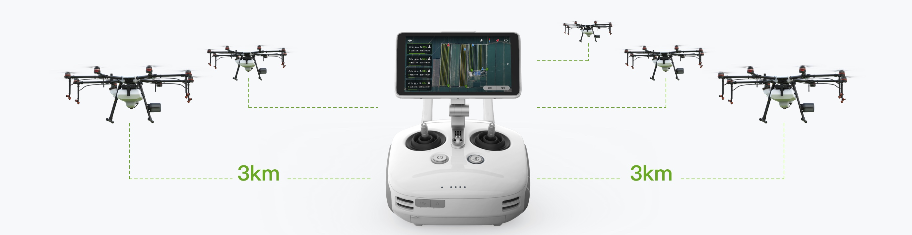
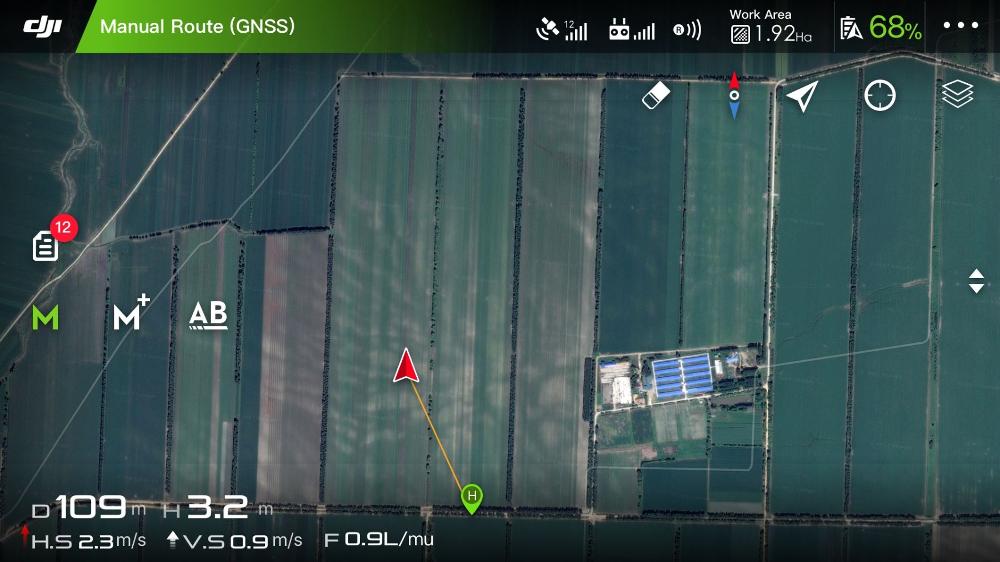
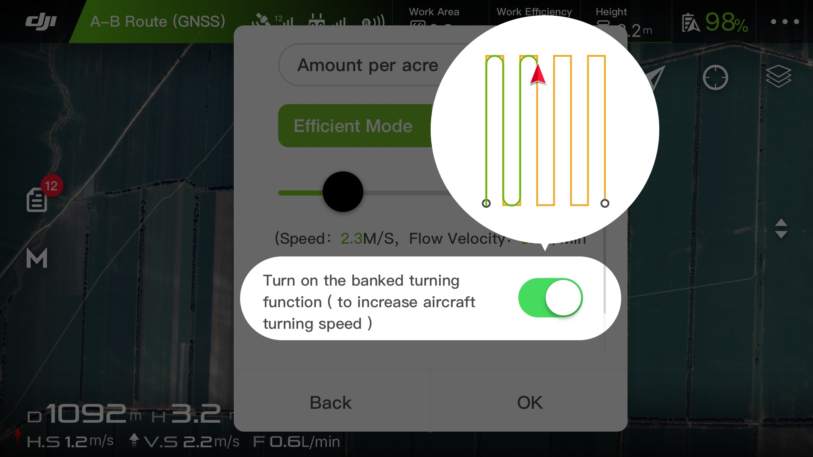

import { Link } from "gatsby"

Tek bir MG-1P pilotu, beş adede kadar MG-1P uçağını aynı anda kontrol ederek tek pilotlu operasyonların verimliliğini ikiye katlayabilir. Bu yeni akıllı uzaktan kumanda, kontrol aralığını 3 km'ye kadar genişletir ve yüksek çözünürlüklü video iletimini destekler Yeni uzaktan kumanda ayrıca 4G kablosuz iletişimi, değiştirilebilir bir bataryayı ve yeni anten tasarımını destekleyerek günlük operasyonlar için daha da fazla kolaylık sağlıyor.

<blockquote>Bir pilot aynı anda 5 ziha kontrol edebilmektedir.</blockquote>

<blockquote display="info">
  Bir ziha 1 saatlik süre içerisinde 60 dönümlük alan ilaçlayabilmektedir. Çoklu
  otomasyon sayesinde bir pilot 5 ziha ile saatte 300 dönüme kadar alanı
  ilaçlama kabiliyetine sahip olmaktadır. Bu da büyük arazilerin ilaçlanmasında
  hız ve etkinlik sağlamaktadır.
</blockquote>

Ziha MG1-P modellerinde v2.0'a yeni çalışma modları eklendi. Multi-Aircraft
Control modu kolay ve sezgiseldir, pilotların tek bir uzaktan kumanda ile
birden fazla uçağı kontrol etmesine kolaylaştırır. Bir diğer yeni çalışma
modu, optimize edilmiş uçuş rotalarını kullanan ve çalışma verimliliğini%
20'ye kadar artıran Banked Turning(Önlemeli Dönüş)'dir. Yeni modların yanı
sıra, A-B Rotası Çalıştırma Modu, Manuel Çalıştırma Modu ve Manuel Artı
Çalıştırma Modu, çok sayıda kontrol seçeneğine izin vermek için hala
kullanılabilir.

<Link to="/posts" className="btn center-btn">
  tüm yazılar
</Link>
