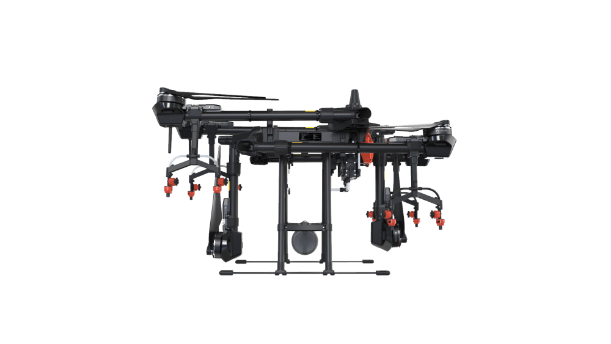
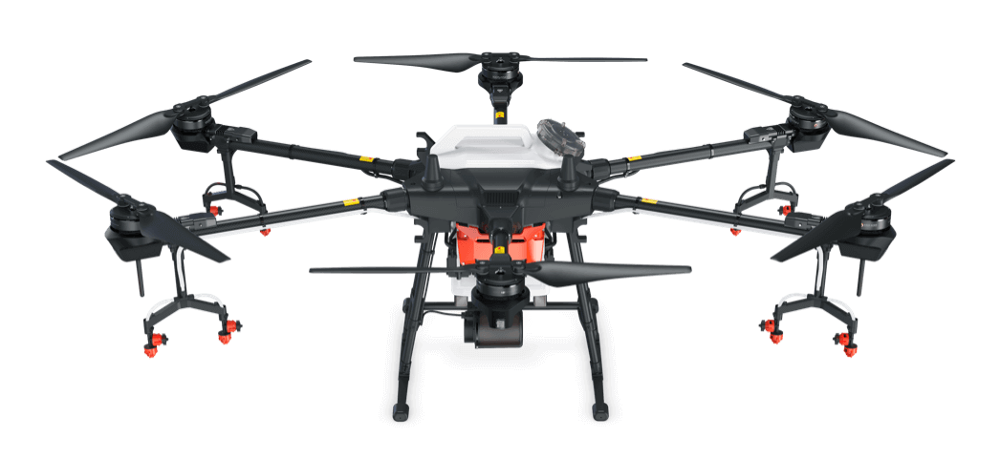
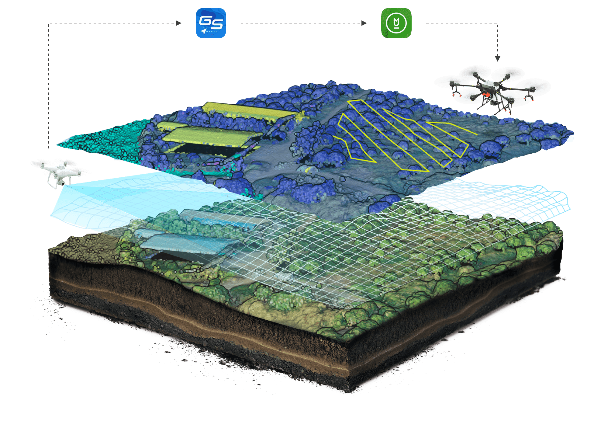
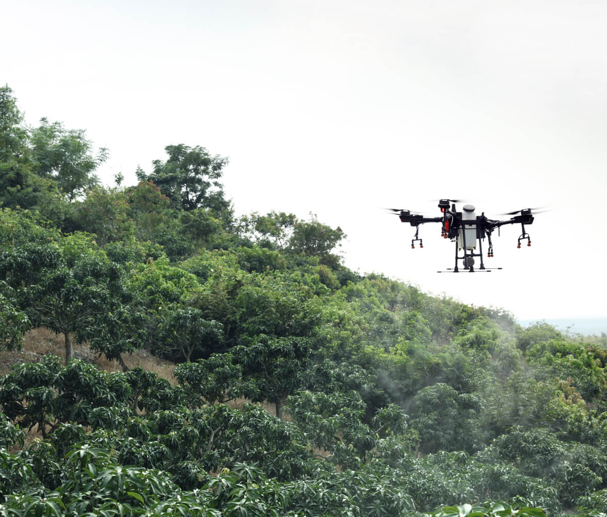
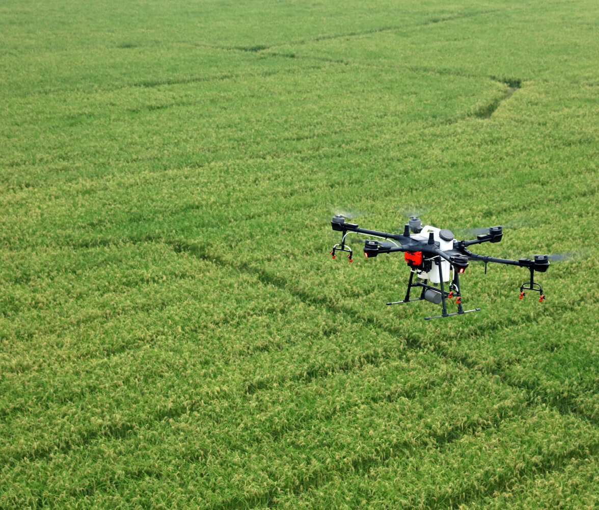
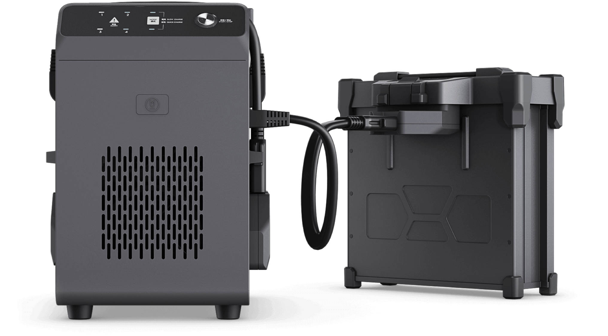

import { Link } from "gatsby"
import { RegVideo, Video } from "../../components/Complete"

<h4>Optimize Edilmiş Güç. Rakipsiz Performans.</h4>

Agras T16, modüler tasarıma sahip gelişmiş bir genel yapıya sahiptir ve bir DJI tarımsal drone'da şimdiye kadarki en yüksek taşıma yükü ve en geniş püskürtme genişliğini destekler. Güçlü donanım, yapay zeka motoru ve 3 boyutlu operasyon planlamasıyla T16, operasyon verimliliğini yepyeni bir düzeye taşır.

<Video src="https://www.youtube.com/embed/Dn7Q4oIrP3I" />

<h4>Devrim Yaratan Yapı. Güvenilir Çalışma.</h4>

T16'nın tamamen yeni modüler tasarımı, montajı basitleştirir ve günlük bakımı hızlandırır. IP67 derecesi, dronun temel bileşenleri için güvenilir koruma sağlar. Hafif ancak dayanıklı bir gövde, karbon fiber kompozitlerden yapılmıştır ve orijinal boyutunun% 25'i hızla katlanarak taşımayı kolaylaştırır. Hem batarya hem de püskürtme tankı kolayca değiştirilebilir, bu da güç ve sıvı tedarikinin verimliliğini önemli ölçüde artırır.

<blockquote display="info">
  Toplanmış haliyle taşıma için az yer kaplayarak avantaj sağlar
</blockquote>

<blockquote display="info">
  16 Litre geniş depolama alanıyla daha fazla alanın ilaçlanmasını sağlar.
</blockquote>

<h4>Daha Yüksek Yük. Gelişmiş Verimlilik.</h4>

Olağanüstü uçuş performansı ile desteklenen T16 püskürtme tankı 16 L'ye kadar taşıyabilir ve püskürtme genişliği 6,5 m'ye çıkarılmıştır. Püskürtme sisteminde 4 dağıtım pompası ve maksimum 4,8 L / dak püskürtme hızına sahip 8 sprinkler bulunur. T16, saatte 24,7 dönüm (10 hektar) püskürtme yapabilir. Püskürtme sistemi ayrıca geleneksel akış ölçerlerden daha yüksek hassasiyet ve stabilite sağlayan yepyeni bir elektromanyetik akış ölçere sahiptir.

<blockquote display="info">
  Arazi verileri analiz dronu ile toplandıktan sonra zihalara aktarılır ve
  zihaların daha verimli otomasyon ilaçlama yapması sağlanır
</blockquote>

T16’nın geliştirilmiş radar sistemi, ışıktan veya tozdan etkilenmeden gündüz veya gece çalışma ortamını algılayabilir. İleri ve geri engellerden kaçınma ve önceki DJI tarımsal dronların iki katı olan 100 ° 'lik yatay FOV (görüş alanı) ile uçuş güvenliğini büyük ölçüde artırdı. Ayrıca bir eğimin açısını algılayabilir ve dağlık arazide bile buna otomatik olarak uyum sağlayabilir. Bu yenilikçi radar sistemi, ortamı etkili bir şekilde algılayan ve engelleri aşmaya yardımcı olan 3B nokta bulutu görüntülemeyi destekleyen Dijital Işın Oluşturma (DBF) teknolojisini benimser.

<h4>Farklı İhtiyaçlar. Farklı Modlar</h4>

T16, çoğu operasyonel ihtiyacı karşılamak için düz zemin, dağlar ve meyve bahçeleri için farklı modlar sunar. Beş adede kadar T16 uçağı, tek bir T16 uzaktan kumanda ile aynı anda kontrol edilebilir, bu da tek pilotlu operasyonun verimliliğini iki katına çıkarır.

<blockquote display="info">Eğimli ağaç ilaçlama</blockquote>

<blockquote display="info">Düz arazi ekin ilaçlama</blockquote>

<h4>T-16 Akıllı Uçuş Bataryası</h4>

T16 Akıllı Uçuş Bataryası, 17.500 mAh kapasiteye ve güç tüketimini azaltan 14S yüksek voltaj sistemine sahiptir. IP54 sınıfı tamamen metal bir muhafaza ile tasarlanmıştır ve ısı yayma verimliliği önceki nesle göre% 140 artmıştır. Hücre dengeleme teknolojisiyle desteklenen pil, önceki nesle göre% 100 daha yüksek [4] 400'e kadar artırılmış şarj döngüsüne sahiptir ve bu da işletim maliyetlerini önemli ölçüde azaltır.

Aynı anda dört adede kadar pil şarj edilebilir. Tek kanallı hızlı şarj modunu kullanırken, tam şarj yalnızca 20 dakika sürer, önceki nesle göre hızda% 50 artış. Şarj cihazında, şarj güvenliğini sağlamak için voltaj ve sıcaklık gibi kritik verileri gerçek zamanlı olarak izleyen yerleşik bir pil sağlığı yönetim sistemi bulunur.

<Link to="/posts" className="btn center-btn">
  tüm yazılar
</Link>
