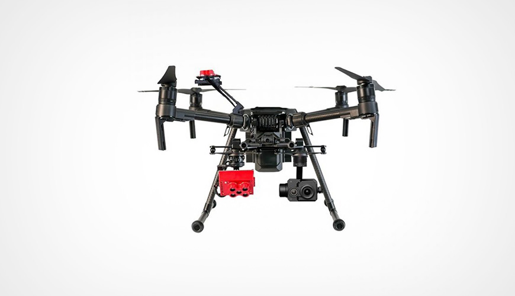
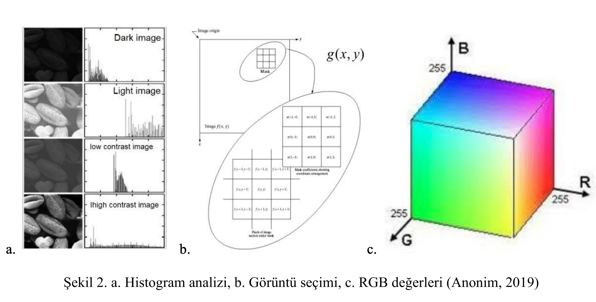

import { Link } from "gatsby"
import { RegVideo, Video } from "../../components/Complete"

Alıntı için : Şin B., Kadıoğlu İ. (2019). İnsansız Hava Aracı (İHA) ve Görüntü İşleme Teknikleri Kullanılarak Yabancı Ot Tespitinin
Yapılması. Turk J Weed Sci, 22(2): 211-217.

<h4>Özet</h4>

Nüfusun her geçen gün artması sonucunda dünya giderek daha fazla gıda maddesine ihtiyaç duymaktadır. Her ne kadar dikkatli olunsa da
başta bitki koruma etmenleri nedeniyle önemli derecede ürün kayıpları yaşanmaktadır. Bu etmenlerin en başında da yabancı otlar
gelmektedir. Tarihsel gelişimde çok farklı metotlar kullanılarak yabancı otlarla mücadele edilmiş olsa da teknolojik gelişmeler ile birlikte
İnsansız Hava Araçlarının (İHA) kullanılması, drone teknolojisinin gelişmesi ve bununla birlikte görüntü işleme tekniklerinin de
gelişerek kombine halinde yabancı otların tespit edilmesi, takibi, teşhisi ve yoğunluklarının belirlenerek şavaşım yöntemlerinin
geliştirilmesi açısından önem taşımaktadır. İHA’lar sayesinde sadece tespit ve yoğunluk çalışmaları değil, ayrıca ilaçlama çalışmalarının
da yapılması zaman, ekonomiklik ve çevreye verilen zararın minimum seviyeye çekilebileceğinin düşünülmesiyle önem teşkil
etmektedir. Hazırlanan bu derleme ile İHA’ların görüntü işleme teknikleri kullanılmak suretiyle yabancı otların tespitindeki önemine
değinilmiştir.
Ürün gözlemciliğinden, multispektral kameralarla donatılmış mahsul algılama dronlarına kadar mahsul sağlığını tespit etme yeteneğine sahiptir. Dronlar, pahalı tarım uzmanlarına veya koşulları izlemek için bir dış kuruma ihtiyaç duymadan özel denetimler gerçekleştirme becerisiyle çiftçilerden tasarruf sağlıyor.

<h4>Giriş</h4>

Dünya nüfusunun sürekli artması nedeniyle tarımsal
üretimin önemi git gide daha çok artmaktadır. M.Ö.
7000’li yıllardan 1830’lu yıllara kadar Dünya nüfusu
yaklaşık olarak 10 milyondan 1 milyara ulaşmıştır
(Cramer, 1967; Özer ve ark., 2003). Ondokuzuncu
yüzyılın başlarında Dünya nüfusu henüz 1 milyar iken bu
sayı 20. yüzyılın başlarında 2 milyara, 21. yüzyılın
başlarında ise 6.5 milyara ulaşmıştır. Bu artışın 2020
yılına gelindiğinde 8.5 milyar, 2030’da 10 milyar ve 2050
yılında ise 12 milyara ulaşacağı tahmin edilmektedir
(TMO, 2009; Acıbuca, 2010). Dünya nüfusu bir yandan
artarken diğer taraftan da dünyanın ihtiyacı olan gıda
maddesi ihtiyacıda artmaktadır. Cramer (1967) buğday,
arpa, yulaf ve çavdar bitkisinde bitki koruma
etmenlerinden dolayı yaklaşık olarak %22.9’luk ürün
kaybı olduğunu bu kayıpların %4.9’unun zararlılardan,
%8.5’lik kısmının hastalıklardan ve %9.5’lik kısmının ise
yabancı otlardan kaynaklandığını bildirmiştir.
Yabancı otlar kültür bitkileriyle su, besin
maddesi ve ışık açısından rekabete girerek verim ve kaliteyi doğrudan etkilemekte, bazı önemli hastalık ve
zararlılara karşı konukçuluk yaparak da kültür bitkilerine
zarar verebilmektedirler (Mennan ve Uygur 1994; Özer
ve ark., 2003; Güncan ve Karaca, 2014; Tepe, 2014).
Yabancı otlara karşı savaşımda çeşitli yöntemler
uygulanmaktadır. Bu yöntemler temel olarak kültürel,
mekanik, biyolojik, fiziksel ve kimyasal yöntemler olarak
sınıflandırılmaktadır. Her ne kadar yabancı otlarla
mücadele edilse dahi dünya’da tarımsal üretimde yaklaşık
olarak %13’lük ürün kaybı olduğu raporlanmış, şayet
herhangi bir mücadele yapılmaz ise bu kayıpların %100’e
kadar çıkabileceği bildirilmiştir (Oerke ve ark., 1994).
Artan nüfus nedeniyle gıda artışının sağlanması
zorunluluk haline gelmiş, ancak ifade edilen bitki koruma
etmenlerine karşı uygulanan mücadele tekniklerine yeni
ve güncel yaklaşımların devreye girmesi gerekliliği ortaya
çıkmış ve bir o kadarda klasik uygulamalar bazı sorunları
da beraberinde getirmiştir (dayanıklılık, kalıntı vb).
Güncel yaklaşımlardan birisi de İHA’lardır. Günümüzde
teknolojinin gelişmesi ile birlikte tarımsal üretimde
sürdürülebilir ve hassas tarım uygulamaları ön plana
çıkmaya başlamıştır. Özellikle insansız hava araçlarının
(İHA) kullanılması, devamında görüntü işleme
tekniklerinin de devreye girmesiyle yeni metotlar
geliştirilerek yabancı ot varlığının tespiti ve mücadelesine
yönelik yeni çalışmalar yapılmaya başlanmıştır. İnsanlık
tarihi kadar eski olan tarımsal faaliyetlerde teknolojik
gelişmelerle üretim artışının yapılması zorunluluk haline
gelmiştir (Teke ve ark., 2016). Hassas tarım
uygulamalarına İHA sistemlerinin girmesi ve bu araçlara
takılacak olan cihazların giderek gelişmesi ile git gide
çalışmalar artış göstermektedir (Zhang ve ark., 2002;
Matese ve ark., 2015).

<h4>İnsansız Hava Araçlarının Tarihi Gelişimi</h4>

İnsansız hava araçları (İHA)’nın başlangıcı 1766 yılında
hidrojen gazının keşfi ile birlikte hava balonlarının
kullanılması olarak kabul edilmektedir (Anonim, 2016a).
İnsansız balonların askeri amaçla ilk defa kullanımı
Amerikan İç Savaşında keşif amaçlı olarak 1793 yılında
kullanıldığı bilinmektedir (Can, 2011). Ondokuzuncu
yüzyılla birlikte hava balonları başta askeri amaçlı olmak
üzere 1800’lü yılların başında Josep Louis Gay Lussac
tarafından bilimsel amaçlı olarak da kullanılmıştır
(Anonim, 2016b; Türkseven ve ark., 2016). İHA’ların
Avusturya’da 1849 yılında uzaktan konrol ile zaman fitilli
bomba taşıyan insansız balonların ilk kez kullanılması
kabul edilmektedir. (Kahveci ve Can, 2017). Günümüzde
modern İHA’ların kullanılması ise 2002 yılında ABD
tarafından askeri amaçlı olarak predatör isimli araçların
kullanılmasına dayanmakta, 2010 yılından sonra ise İHA
teknolojisi sivil uygulamalarda kullanıma açılmıştır
(Türkseven ve ark., 2016). Gelişmelerin gereği olarak
özellikle 2013 yılından sonra farklı devletler İHA
kullanımına yönelik çeşitli hukuksal düzenlemeler
getirmişlerdir (Yardımcı, 2019).
Mevzuata göre İHA; aerodinamik kuvvetler
aracılığıyla sürekli uçuş yapma yeteneğinde olan, üzerinde
pilot bulunmaksızın uzaktan İHA pilotu tarafından kontrol
edilerek veya otonom operasyonu İHA pilotu tarafından
planlanarak uçurulan ya da havada kalabilen hava aracı
şeklinde tanımlanmaktadır (SHGM, 2016). Günümüzde
İHA’lar askeri amaçlar dışında haberleşme, haritacılık,
fotoğrafçılık, güvenlik, bilimsel veri toplama, haritacılık,
enerji, tarım, sağlık, sigorta, reklamcılık, acil durumlar
şeklinde kullanılmakta, teknolojik gelişmelerin ve
taşıyabilecekleri ağırlıkların artmasıyla kargo
taşımacılığında da kullanılmaktadır (Walsh, 2017;
Yardımcı; 2019).

<h4>İnsansız Hava Araçlarının Türkiye’deki Sınıflandırılması</h4>

Teknolojik gelişmeler ve ticari amaçlı kullanımlarının da
ortaya çıkması nedeni ile insansız hava araçları farklı
şekillerde isimlendirilmeye başlanmıştır. Yapılan
tanımlamalara göre uluslararası platformlarda İHA’lar
irtifa durumlarına göre sınıflandırılması yapılsa da
(Blyenburgh, 1999), Sivil Havacılık Genel
Müdürlüğü’nce (SHGM) İHA’lar kanat yapıları ve
taşıyabildikleri yük ağırlığına göre sınıflandırılmaktadır.
Kanat yapılarına göre İHA’lar sabit kanat ve döner kanat
(multicopter) olarak ikiye ayrılmaktadır. Burada özellikle
döner kanatlı İHA’ların kullanımı söz konusu olmakla
birlikte bu araçlar minimum 3 motorlu, maksimum ise 16
motorlu olacak şekilde tasarlanmaktadır (Şekil 1) (SHGM,
2019). İHA’nın kullanım amacına ve kaldırması gereken
ağırlığa göre kullanılması gereken motor sayısı
değişmektedir.
Kaldırdığı ağırlık bakımından İHA’lar 4 farklı başlık
altında toplanmaktadır (SHGM, 2016). Bunlar ise
a) İHA0: Azami kalkış ağırlığı 500 gr (dâhil) – 4kg
aralığında olan İHA’lar,
b) İHA1: Azami kalkış ağırlığı 4 kg (dâhil) – 25 kg
aralığında olan İHA’lar,
c) İHA2: Azami kalkış ağırlığı 25 kg (dâhil) – 150
kg aralığında olan İHA’lar,
d) İHA3: Azami kalkış ağırlığı 150 kg (dâhil) ve
daha fazla olan İHA’lar, olarak
sınıflandırılmaktadır.
Beş yüz gr ve üzerindeki İHA’ların ticari olarak
kullanılması için SHGM tarafından verilen uçuş
ehliyetinin alınması gerekmektedir. Askeri amaçlı
kullanılanların dışında çoğunlukla sivil hayatta
kullanımda olan döner kanatlı İHA’lar ayrıca drone
olarakta isimlendirilmektedir. (Kahveci ve Can, 2017).

<h4>İnsansız Hava Araçlarının Tarımdaki Rolü</h4>

İnsansız hava araçlarının tarımsal amaçlı kullanılması
özellikle sürdürülebilir ve hassas tarım uygulamaları
açısından son derece önemlidir. Tarımsal açıdan İHA’lar
su kaynaklarının kontrolü, ürün gözlemi, ekipman ve bina
gözlemi, haritalama, verim kontrolü, toprak erozyonu, su
stresi, hastalık, zararlı ve yabancı ot tespiti ve
mücadeleleri gibi çok farklı alanlarda kullanılabilmektedir
(Türkseven, 2016; Özgüven, 2018).

<h4>Yabancı Otların İnsansız Hava Araçları ile Varlığının Tespiti</h4>

Gelişen teknoloji ile birlikte kameraların görüntü
kalitesinin artması ve bu artışa rağmen kameraların
küçülmesi sonucunda İHA’lar arazi koşullarında yabancı
otları tespit edebilmektedir. Bunun için farklı özellikteki
kameralar kullanılmakta, yapılan tespitler ile bu yabancı
otlar ile mücadele yapılabilecek hale gelmektedir.
İHA’lara takılacak olan kameralardan alınacak veriler
farklı işlemlerden geçirilerek mevcut olan floranın
haritasının çıkartılabileceği (Özgüven, 2018) gibi
oluşabilecek ürün kayıplarının da hesaplanması
sağlanmaktadır. Yabancı otların tespiti için kullanılan
kameraların genel olarak kızıl ötesi (NIR) veya NDVI
(Normalized Difference Vegetation Index) özellikte
olmasına dikkat edilmelidir (Teke ve ark., 2016). Bu
tespit kızıl ötesi kameralar ile bitkilerin yakın kızıl ötesi
bandının (NIR), kırmızı (R) banda oranının belirlenmesi
ile yapılabilmektedir. Kızıl ötesi olarak hesaplanan bitki
indeksi (VI) bitkiden bitkiye farklılık göstermektedir
(Düzgün, 2010; Özgüven, 2018). NDVI kameralarından
elde edilen verilerle daha çok bitki örtüsünün durumu ve
büyümesi, yaprak alanı indeksi ve bitki boyu gibi
özellikler elde edilebilmektedir (Özgüven, 2018). Hedef
bölgenin tanımlanması sonucunda yapılan uçuşlar ile İHA
tarafından gerekli görüntüler kayıt altına alınabilmektedir.
Kayıt altına alınan bu görüntüler daha sonradan işlemlere
tabi tutulmak sureti ile yabancı otun türü ve varlığı,
yabancı ot yoğunluğu, yabancı otun ekonomik zarar
seviyesi bilinen kültür bitkilerinde ekonomik zarar
seviyesinde olup olmadığı belirlenmekte ve bu yabancı
ottan kaynaklı olarak oluşabilecek ekonomik kayıpların
analizi yapılabilmektedir. Böylece oluşturulacak olan küresel koordinat noktasının (GPS) bilinmesi ile noktasal
olarak yabancı ot ile mücadele yapılmak suretiyle
gereksiz herbisit kullanımının önüne geçilmiş olunacaktır.

<h4>Görüntü İşleme Yöntemi</h4>

Görüntü işleme yöntemi; çekilmiş olan bir resmin dijital
olarak bilgisayar ve yazılım desteği ile değiştirilmesi
uygulaması olarak tanımlanmaktadır. Görüntü işleme
uygulamaları başlangıçta askeri ve güvenlik amacıyla
kullanılmakta iken günümüzde sürdürülebilir ve hassas
tarıma da hizmet etmektedir (Ağın ve Malaslı, 2016). İlk
kez 1920’li yıllarda medyanın gelişmesi ile dijital
görüntülerden bahsedilmiş, yine aynı dönemlerde dijital
olarak Londra’dan New York’a sualtından döşenmiş olan
kablolar sayesinde görüntülerin aktarımı sağlanmıştır.
Görüntü işlemenin gerçekleşmesi için 3 temel basamak
önemlidir. Bunlardan ilki elde edilen görüntünün dijital
formata çevrilmesidir. İkinci basamak olarak elde edilen
görüntünün istenilen formata çevrilmesi ve düzenlenmesi
gelmektedir. Üçüncü ve son basamak ise gerekli analizin
yapılarak görüntüden sonuç alınması izlemektedir. Bir
görüntünün dijital olarak işlenebilmesi için öncelikle veri
kütüphaneleri oluşturulması ve dijital ortama sorunsuz
şekilde aktarılması gerekmektedir. Mevcut veri
kütüphanelerinin oluşturulmasının ardından seçilmiş olan
resimlerin işlenmesine sıra gelmektedir. Bunlar için 3
farklı işleme tekniği kullanılmaktadır.
Bunlardan ilki beyaz-gri dengesi olarak geçen
histogram işlemidir. Buradaki amaç dijital görüntüdeki
beyaz-gri dengesinden yararlanılarak görüntüdeki şeklin
belirlenmesidir (Şekil 2a).
İkinci yöntemde görüntü filtrelemesi
kullanılmaktadır. Görüntü filtreleme işinde elde bulunan
dijital görüntünün gridlere bölünmek suretiyle istenilen
kısmının kullanılıp işlenmesi amaçlanmaktadır (Şekil 2b).
Üçüncü olarak ise temel renk model baz alınmak
suretiyle R-G-B (red-green-blue) değerlerinden
yararlanarak dijital görüntünün tanımlanmasının
yapılmasıdır (Şekil 2c)

Doğru işleme yöntemi seçiminin ardından ideal
bir işleme programının seçilmesi (Matlab, phyton gibi) ve
verilerin işlenmesi gerçekleştirilmektedir. İşleme
gerçekleştikten sonra elde edilen verilerin yorumlanması
ve kullanılması gerekmektedir. Teknolojik gelişmeler ile
birlikte elde edilen veriler sadece daha sonra kontrol
edilmeyip anlık değerlendirmeler ile de (real time)
kullanılabilmektedir (Şin ve ark., 2019).

<h4>Görüntü İşleme Teknikleri ile Yabancı Ot Tespitinin Yapılması</h4>

Bu başlık altında görüntü işleme teknikleri ile ilgili
yapılmış bazı bilimsel çalışmalardan söz edilecektir.
Montalvo ve ark. (2012) mısır bitkisinde yüksek yabancı
ot baskısında sıra üzeri çizgisinin belirlenmesi için farklı
çözünürlükte görüntülerle uygulamalar yapmışlardır. Elde
ettikleri RGB görüntülerini daha sonra gri seviyesine
çevirerek mısır içerisinde bulunan yabancı otları
maskeleyerek mısırın sıra üzeri çizgisini belirlemeye çalışmışlardır. Yine Tellaeche ve ark. (2011) herbisit
kullanımını azaltabilmek amacıyla görüntü işleme
tekniklerini kullanmışlardır. Bu araştırmacılar kültür
bitkisi yabancı ot ayrımını yapmak ve buna göre ilaçlama
bölgelerini belirlemek istemişlerdir. Elde ettikleri renkli
görüntüleri siyah-beyaz renk formatına getirerek yeşil
vejetasyon noktalarını tespit etmişlerdir. Sonuç itibariyle
bu çalışma ile yabancı ot bölgelerinin tayininin
yapılabileceğini ve buna bağlı olarak herbisit kullanımının
azaltılabileceğini rapor etmişlerdir.
Artizzu ve ark. (2011) mısır üretim alanlarında
yabancı ot ve kültür bitkisinin varlığını anlık olarak
görüntü işleme teknikleri ile ortaya koymaya
çalışmışlardır. Traktöre yerleştirmiş oldukları kamera ile
elde ettikleri görüntüler sonucunda anlık olarak yapılan
değerlendirmede kültür bitkisinde %80 ve yabancı ot
tespitinde %95 başarı elde ettiklerini bildirmişlerdir.
Rahman ve ark. (2015) yabancı ot tespitinde
kullanılabilecek bir mobil uygulama geliştirmişlerdir. Bu
bağlamda oluşturmuş oldukları kütüphaneler ile elde
edilen veriler kullanılarak teşhis işlemini
gerçekleştirmişlerdir. Tekin ve ark. (2016) mücadelede
yabancı otların tespitinin yapılması ve takibinin son
derece önemli olduğundan bahsetmişlerdir. Klasik
yöntemler ile flora tespit çalışmalarının yapılmasının yanı
sıra daha az zaman alan, daha ekonomik ve hassas şekilde
floranın takibinin insansız hava araçları ile
yapılabileceğini bildirmişlerdir. Tang ve ark. (2016) yine
mısırda yabancı ot yoğunluğunu belirlemeye yönelik
yapmış oldukları çalışmada vejetasyon tayini ve sıra üzeri
çizgisinin belirlenmesini hedeflemişlerdir. Yapılan
çalışmada anlık yabancı ot yoğunluğu ile aynı görsel
üzerinde uzman görüşü esas alınmak suretiyle model
oluşturmuşlardır.
Demir ve ark. (2016) Erciyes Üniversitesi’nde
yapmış oldukları çalışma ile sirken, yabani marul ve eşek
marulunun dijital görüntülerini elde edip RGB değerlerini
tonlamışlardır. Elde edilen verilerden renk ölçüm cihazı
kullanılmadan sadece dijital kamera verisi ve görüntü
işleme tekniği kullanarak bitkilerin kıyaslama için yeterli
olabileceği sonucunu ortaya çıkarmışlardır.
Türkseven ve ark. (2018) İzmir, Menemen’de
pamuk arazisinde bulunan yabancı ot florasını klasik
yöntemlere alternatif olarak İHA’lar ile tespit çalışmaları
yapmışlardır. Kullanmış oldukları sabit kanatlı İHA ile
550, 660, 735 ve 790 nm bandlarında ölçüm yapabilen
kamera kullanarak alçak irtifa uçuşu ile görüntü
toplamışlardır. Ayrıca mevcut olan yabancı otların
yerlerini de GPS koordinatı olarak kaydetmişlerdir. Elde
ettikleri görüntüleri tek bir programa dönüştürdükten
sonra gerek RGB gerek ise NDVI haritalarının yabancı ot
tespitinde işe yaradığını tespit etmişlerdir. Güzel ve ark.
(2019) Tokat’ta gerçek zamanlı olarak buğday arazisinde
yabani hardal (Sinapis arvensis L.) popülasyonunun
varlığına dair yapmış oldukları çalışmada YOLOv3
programını kullanmışlar, elde edilen verilere göre buğday
arazisindeki yabani hardal popülasyonunu %95-99
oranında doğru olarak tespit ettiklerini bildirmişlerdir.
Şin ve ark. (2019) görüntü işleme tekniklerinin
günümüzde yabancı otların tespitinde kullanılmakta
olduğunu, bu tekniğin gelişmesi ile görüntü işleme
yöntemlerinin yardımıyla teknolojik savaşım
yöntemlerinin de geliştirilebileceğinden bahsetmişlerdir.
Görüldüğü gibi yakın tarihi kapsayan özellikle
yabancı otların belirlenmesi ve teşhisine yönelik
çalışmalar artmıştır. Bitki korumanın diğer konularında
olduğu gibi tarımsal üretimde de İHA’ların kullanımı ile
ilgili çalışmalar mevcuttur.

<h4>Sonuç</h4>

Sonuç olarak öncelikle askeri ve güvenlik amacıyla
başlayan İHA’lar insanoğlunun diğer aktivitelerinde de
kullanılmaktadır. Konumuz olan tarımda kullanılması da
daha yoğun bir şekilde yaygınlaşmaya başlamıştır. İnsan
tüketimine sunulan gıda ürünlerinin üretimini arttırmaya
katkı sağlayacağı bir gerçektir. Bu yöntemle bitki koruma
etmenlerinin tespiti ve mücadelesine yönelik çalışmalar
da yapılmaktadır. Kültür bitkilerinde sorun oluşturan
yabancı otların belirlenmesi, tanılanması, takibi ve
mücadelesinin klasik yöntemler ile yapılması çoğu zaman
hem çok aşırı zaman almakla hem de ciddi miktarda
ekonomik sonuçları olabilmektedir. Özellikle yapılacak
olan otomasyon sistemleri ile görüntü işleme teknolojisi
yabancı ot kontrolü için son derece önemli bir hal
alacaktır. Bu yöntemin geliştirilmesi ve pratik hale
getirilmesi ile kültür alanlarındaki yabancı otların
mücadelesine yönelik daha pratik çözümler getirmesi
beklenmektedir. Bu konudaki teknolojinin hızla
gelişmesi, insansız hava araçlarının ortaya çıkması ve
kamera sistemlerinin ilerlemesine bağlı olarak görüntü
işleme yöntemlerinin devreye girmesi insansız hava
araçlarının tarımı da içeren farklı kollarda hayatımıza
girmesi kaçınılmaz olacaktır.. Önümüzdeki süreçte
teknolojik gelişmelerin devam edeceği ve İHA’ların
hayatımıza daha çok gireceği, böylece tarımsal açıdan da
insansız hava aracı veya drone’ların kullanımının daha da
hız kazanacağı düşünülmektedir. Özellikle droneların
kullanımı sırasında şarj ünitelerinin kullanılması, ayrıca
uçarak arazi bozukluklarına takılmadan kullanılabilmesi
petrol ürünleri ile çalışan araçlara göre daha ekonomiklik sağlayacağı kanaatini doğurmuştur. Ancak bu yeni
teknolojinin uygulanmasında yasal kısıtlamalar ve
güvenlik gibi olası zorluklar da dikkate alınmalıdır. Bu
nedenle hem olası zorluklarının çözümü için hem de olası
yan etkilerine yönelik ve pratiğe verilebilecek bilimsel
temel araştırmaların yapılması gerektiği kanaatindeyiz.

<h4>KAYNAKÇA</h4>

Acıbuca V. 2010. Mardin ilinde makarnalık buğday üretim ekonomisi. Yüksek Lisans tezi, Çukurova Üniversitesi, Fen
Bilimleri Enstitüsü, Adana.
Ağın O., Malaslı Z. (2016). Görüntü işleme tekniklerinin sürdürülebilir tarımdaki yeri ve önemi: Literatür çalışması. Tarım
Makinaları Bilimi Dergisi. 2016, 12 (3), 199-206.
Anonim (2016a). http://www.notablebiographies.com/CaCh/Cavendish-Henry.html. Erişim tarihi: 01.12.2019
Anonim (2016b). http://www.groups.dcs.st-and.ac.uk/history/Biographies/Biot.html. Erişim tarihi: 01.12.2019
Anonim 2019. https://www.mathworks.com/products/image.html (Erişim tarihi : 01.11.2019)
Artizzu X P B., Ribeiro A., Guijarro M., Pajares G. (2011). Realtime image processing for crop/weed discrimination in
maize fields. Computers and Electronics in Agriculture, 75: 337–346.
Blyenburgh P.V. (1999). UAVs: an Overview. Uninhabited Aerial vehicles (UAVs), Air and Space Europe Vol:1, No:5/6.
Pp. 43-47.
Can N. (2011). Chicago konvansiyonu’na kadar devletlerarası hava hukuku alanındaki bazı düzenlemeler, TALPAKokpitten Bakış Dergisi.
Cramer H.H. (1967). Pflanzenschutz und Welternte. Pflanzenschutz-Nachrichten “Bayer”20:1-523, Leverkusen.
Demir B., Çetin N., Kuş Z.A. (2016). Görüntü işleme tekniği ile yabancı ot renk özelliklerinin belirlenmesi.
Alınteri 31 (B)-2016, 59-64. ISSN: 1307-3311.
Düzgün H.Ş. (2010). Uzaktan algılamaya giriş dersi, Ünite 5- Veri görüntü önişleme. Ulusal Açık Ders Malzemeleri
Konsorsiyumu.
Güncan, A., Karaca M. 2014. Yabancı ot mücadelesi (Güncelleştirilmiş ve İlaveli Üçüncü Baskı) Selçuk Üniversitesi Ziraat
Fakültesi Yayınları Konya, 310s.
Güzel M., Şin B., Turan B., Kadıoğlu İ. (2019). Real-Time detection of wild mustard (Sinapis arvensis) with deep learning
(YOLO). IASTEM- 648th International Conferance on Environment and Natural Science Paper-13198.
Kahveci M., Can N. (2017). İnsansız hava araçları: Tarihçesi, tanımı, dünyada ve Türkiye’deki yasal durumu. Selçuk
Üniversitesi Mühendislik, Bilim ve Teknoloji Dergisi, 5 (4), s.511-535.
Matese A., Toscano P., Di Gennaro S.F., Genesio L., Vaccari F.P., Primicerio J., Belli C., Zaldei A., Bianconi
R., Gioli B. (2015). Intercomparison of uav, aircraft and satellite remote sensing platforms for precision
viticulture. Remote Sensing, 7(3):2971-90.
Mennan H., Uygur F.N. (1994). Samsun ili buğday ekim alanlarında görülen yabancı otların saptanması. OMÜ Ziraat
Fakültesi Dergisi, 9(2):25-35, 1994.
Montalvo M., Pajares G., Guerrero JM., Romeo J., Guijarro M., Ribeiro A., Ruz JJ., Cruz JM. (2012). Automatic detection
of crop rows in maize fields with high weeds pressure. Expert Systems with Applications, 39: 11889-11897.
Oerke EC., Dehne HW.,Schonbeck F., Weber A. (1994) Crop production and crop protection-estimated losses in major
food and cash crops. Elsevier Science, Amsterdam, 808 pp.
Özer Z., Kadıoğlu İ., Önen H., Tursun N. (2003). Herboloji (Yabancı Ot Bilimi). Gaziosmanpaşa Üniversitesi Ziraat
Fakültesi Yayınları No:20 Kitaplar Serisi No:10, Genişletilmiş 3. Baskı 409 s, TOKAT.
Özgüven M.M. (2018). Hassas Tarım. Akfon kitap kırtasiye, 334s. Ankara. ISBN: 978-605-68762-4-0
Rahman M., Blackwell B., Banerjee N., Saraswat D. (2015). Smartphone-based hierarchical crowdsourcing for weed
identification. Computers and Electronics in Agriculture, 113: 14–23.
SHGM (2016). Sivil Havacılık Genel Müdürlüğü İnsansız Hava Aracı ve Pilot Kayıt Sistemi.
SHGM (2019). İnsansız Hava Aracı pilotluk eğitim ders notları.
Şin B., Kadıoğlu İ., Sarı T. (2019). Detectıon and ıdentıfıcatıon of weed by ımage processıng techniques. BIALIC, 7-8
Novamber 2019, s. 40, Lviv Ukraine.
Tang J., Chen X., Miao R., Wang D. (2016). Weed detection using image processing under different illumination for sitespecific areas spraying. Computers and Electronics in Agriculture, 122: 103–111.
Teke M., Deveci S., Öztoprak F., Efendioğlu M., Küpçü R., Demirkesen C., Şimşek F.F., Bağcı B., Uysal E., Türker U.,
Yıldırım E., Bayramin İ., Kalkan, Demirpolat C. (2016). Akıllı tarım fizibilite projesi: hassas tarım uygulamaları
için havadan ve yerden veri toplanması, işlenmesi ve analizi. 6. Uzaktan Algılama-CBS Sempozyumu (UZALCBS 2016), 5-7 Ekim 2016, Adana.
Tekin A.B., Türkseven S., Kızmaz M.Z., Urkan E., Serim A.T. (2016). Tarım alanlarında yabancı ot florasının insansız
hava araçları ile izlenmesi. Uluslararası Katılımlı Türkiye VI. Bitki Koruma Kongresi 5-8 Eylül 2016, Konya,
Türkiye.
Tellaeche A, Pajares G, Artizzu X P B, Ribeiro A (2011). A computer vision approach for weeds identification
through Support Vector Machines. Applied Soft Computing, 11: 908–915.
Tepe I. (2014). Yabancı otlarla mücadele. Sidaş yayın evi. ISBN: 60551671.
TMO 2009. TMO, 2009. Hububat Sektör Raporu, 2008-2009, Ankara.
Türkseven S., Kızmaz M.Z., Tekin A.B., Urkan E., Serim A.T. (2016). Tarımda dijital dönüşüm, insansız hava
araçlarının kullanılması. Tarım makinaları bilim dergisi, 12 (4), 267-271.
Türkseven S., Tekin B., Kızmaz M.Z., Urkan E., Serim A.T. (2018). İnsansız hava araçları ile pamukta yabancı ot
florasının tespit edilme olanakları. Türkiye VII. Bitki Koruma Kongresi (Uluslararası Katılımlı), 14-17 Kasım
2018, Muğla Türkiye.
Walsh W.H. (2017). “The Drone Liability Lawsuit: Who gets sued and Why?” American Bar Association The Forum on
Air&Space Law.
Yardımcı G. (2019). İnsansız hava araçlarına Türk mevzuatından bir bakış. Journal of Aviation 3 (1):61-80 (2019).
Zhang N., Wnag M., Wang N., 2002. Precision agriculture-A worldwide overview. Computers and electronics in
agriculture 36(1), 113-132.

<Link to="/posts" className="btn center-btn">
  tüm yazılar
</Link>
