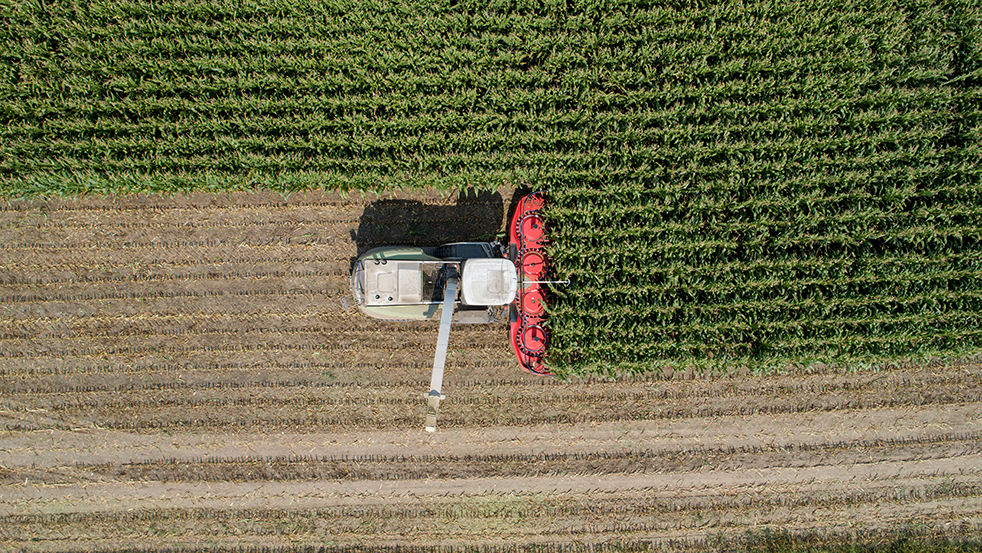
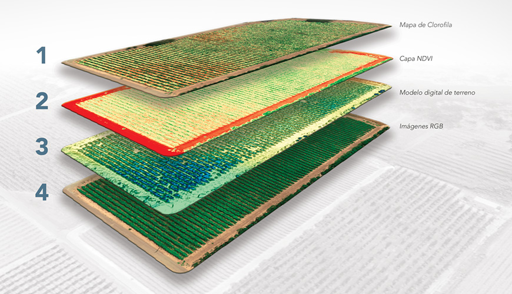
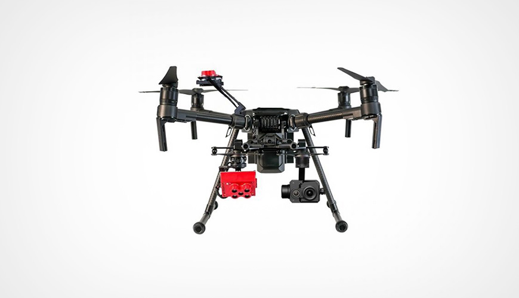

import { Link } from "gatsby"
import { RegVideo, Video } from "../../components/Complete"

Ürün gözlemciliğinden, multispektral kameralarla donatılmış mahsul algılama dronlarına kadar mahsul sağlığını tespit etme yeteneğine sahiptir. Dronlar, pahalı tarım uzmanlarına veya koşulları izlemek için bir dış kuruma ihtiyaç duymadan özel denetimler gerçekleştirme becerisiyle çiftçilerden tasarruf sağlıyor.

SenseFly eBeeX gibi sabit kanatlı dronlardan büyük ölçekli algılama yapmak için veya Parrot Bluegrass Fields Drone ile sorunlu alan keşiflerini yapmak için burada Dronefly'de size yardımcı olmaya hazırız. Bu blogda, algılama teknolojisi ve tarım, çiftçilik ve hayvancılık endüstrilerindeki bazı farklı kullanım durumları hakkında size rehberlik edeceğiz.

<h4>Analiz Araçları</h4>

Mahsul sağlığını incelemek için tarlalarda yürümek zaman alıcı, pahalı ve verimsizdir. Özel kamera sensörleri eskiden çok pahalı ve ağırdı, bu da insanlı uçaklarda taşınmaları gerektiği anlamına geliyordu. Artık algılama teknolojisinin çok daha kompakt hale gelmesiyle ve dronların ortalama bir kişi tarafından kullanımı çok daha kolay hale gelmesiyle ( SenseFly eBeeX kendi kendine uçabilir), bu uzaktan algılama teknolojisi çiftçiler tarafından verimliliği artırmak ve daha fazla verim elde etmek için kullanılabilir.

<Video src="https://www.youtube.com/embed/RQdf-CZam3A" />

<h4>Mahsul Muayene ve Analizi</h4>

MicaSense altum , MicaSense RedEdge-MX ve papağan Sequoia gibi multispektral sensörler ekinin yapraklarının yansıyan ışık belirli bantlar analiz etmek için ayarlanmıştır.
Bu aşağı bakan sensörler, güneşten gelen ışık miktarını ölçmek için dronun üstüne
yerleştirilmiş yukarı bakan bir ışık okuyucusuna da sahiptir. Sensördeki yazılım,
bir oran oluşturmak için yukarıdan gelen ışık miktarını ve alttaki mahsullerden yansıyan
miktarı okur.

Araştırmanın amacına bağlı olarak farklı oranlar hesaplanabilir, tipik bir oran normalize edilmiş fark bitki örtüsü indeksidir (NDVI). Bu orandan aşağı bakan sensörler ve yukarı bakan sensör, kısmen bulutlu veya güneşli bir gün olsa da mahsul sağlığını tespit edebiliyor.

Aşağıdaki grafik, tarım veya yakın kızılötesi (NIR) sensörünün mavi, yeşil, kırmızı, mor ve gri çubuklarla analiz ettiği 5 ayrı bandı göstermektedir. Multispektral bant sensörü, bitkilerin fotosentez için kullandıkları bu ışık dalga boyları arasındadır. Drone endüstrisi, drone'lara monte edilmiş yakın kızılötesi (NIR) sensörlerin ve çoklu spektral sensörlerin (RGB, RedEdge ve NIR) uyarlanmasıyla ürün denetimini bir sonraki seviyeye taşıdı. NIR sensörleri, bitkilerin fotosentez için ışığı absorbe etmek için kullandıkları ışık spektrumunu algılar. Yazılım analizi, belirli bir mahsul türünü ve hatta belirli bir mahsulün yaşamın hangi aşamasında olduğunu yansıtmak için değerleri değiştirmek için kullanılabilir.

<Video src="https://www.youtube.com/embed/34rrOqqVkog" />

<h4>NDVI nedir?</h4>

NDVI, bitkiler tarafından emilen ve yansıtılan ışık enerjisi miktarının bir oranıdır, bu bitki sağlığını ölçer. Hesaplama: (NIR - RED) / (NIR + RED). Genel olarak, NDVI değerleri -1.0 ile 1.0 arasında değişir; negatif değerler su gibi nesneleri belirtir, sıfıra yakın pozitif değerler çıplak toprağı gösterir ve daha yüksek NDVI değerleri seyrek bitki örtüsünden (0.1 - 0.5) yoğun bitki örtüsüne (0.6 ve yukarıda). Sonuç olarak, bu teknoloji gübre, sulama, hastalık veya zararlı böceklerle karşılaşılan sorunlu alanlar için bir uyarı aracı olarak hizmet eder.

<h4>Kırpma Alanı Haritalama</h4>

NDVI sensörlerinden toplanan verilerle. her kare için GPS koordinatlarını içerir. ekin alanı alanının kapsamlı bir haritasını çıkarabilir. Bu, çiftçilerin arazi kullanımını ve ürün değişkenliğini en üst düzeye çıkarmak için ekinlerin nerede ekileceğini daha iyi planlamalarını sağlar. Daha iyi haritalama ayrıca su verimliliğini ve gübre kullanımını artırır. Mahsuller için ideal yerin daha iyi anlaşılmasıyla, artan verimlilik ve daha düşük maliyet beklenir.

<h4>Hayvancılık İzleme</h4>

Bir çiftlikte termal görüntüleme kameralarına sahip dronlar, birden fazla kullanım durumuna hizmet edebilir. Termal kameralı drone'lar, tek bir uzaktan kumandalı pilotun komuta ettiği hayvancılık hareketlerini uzaktan izleyebilir. Matrice 210 gibi termal kamera dronları , yüksek güçlü zoom kamera ve kızılötesi kamera gibi aynı anda iki kamera taşıyabilir . Çalışan ekipleri kontrol etmek veya çiftlik hayvanlarını izlemek, bir drone yardımıyla hiç bu kadar kolay olmamıştı. Kızılötesi bir drone ile zamandan tasarruf edin ve mülk bilincini artırın. Ürün incelemesi yapmak ve DJI Matrice 210 ile de bir seçenek olan bir termal kamera taşımak istiyorsanız.

<h4>Özetlemek gerekirse</h4>

Dronlar, daha alçaktan ve daha kesin bir şekilde uçma kabiliyetine sahip olduklarından, uydulardan veya uçaklardan daha fazla çözünürlük sağlar. Dronların bir başka avantajı, kolay taşınabilirlik ve maliyet nedeniyle daha yüksek tarama frekansıdır. SenseFly eMotion gibi yazılımlar ( senseFly eBeeX ile birlikte gelir ), kullanıcıların belirli bir GPS alanını seçmelerine olanak tanır ve drone, operatöre ihtiyaç duymadan uçar ve seçilen alanı haritalandırır.

Buna ek olarak, insansız hava araçları, meralardaki herhangi bir sorunu tespit etmek için çiftlik hayvanlarının uzaktan kolayca izlenmesini sağlar. Drone'lar, işlerini daha verimli ve daha düşük bir maliyetle yapmak için gerekli araçları bize besleyen insanlara gerçekten veriyor.

<Link to="/posts" className="btn center-btn">
  tüm yazılar
</Link>
