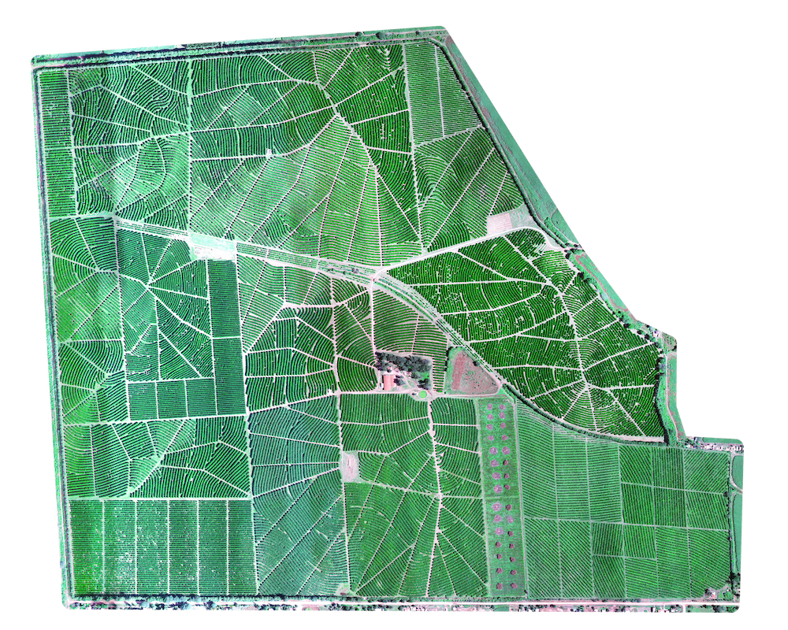
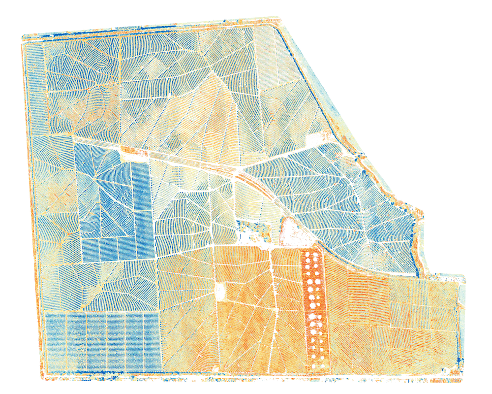
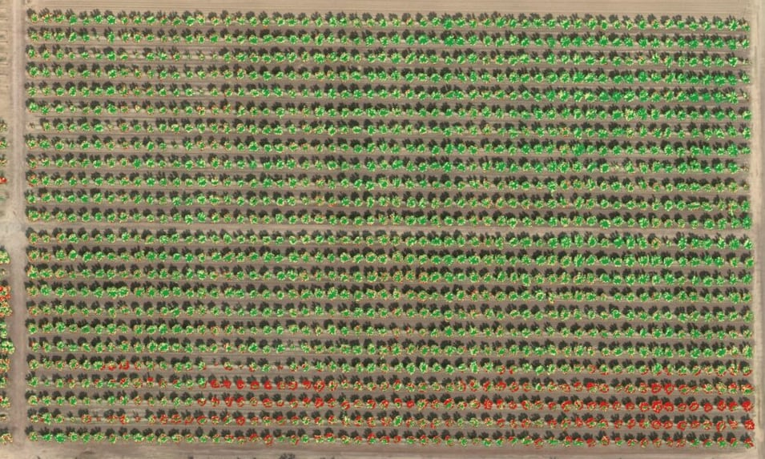
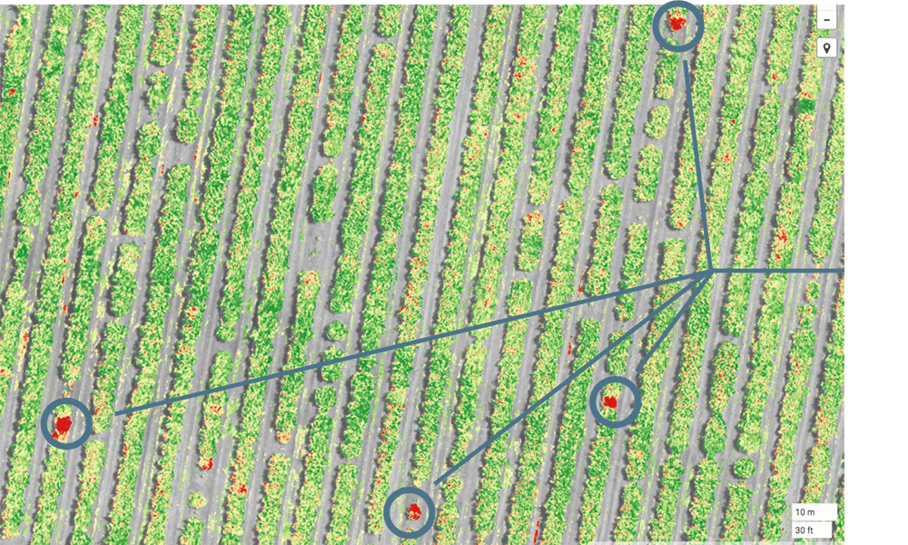
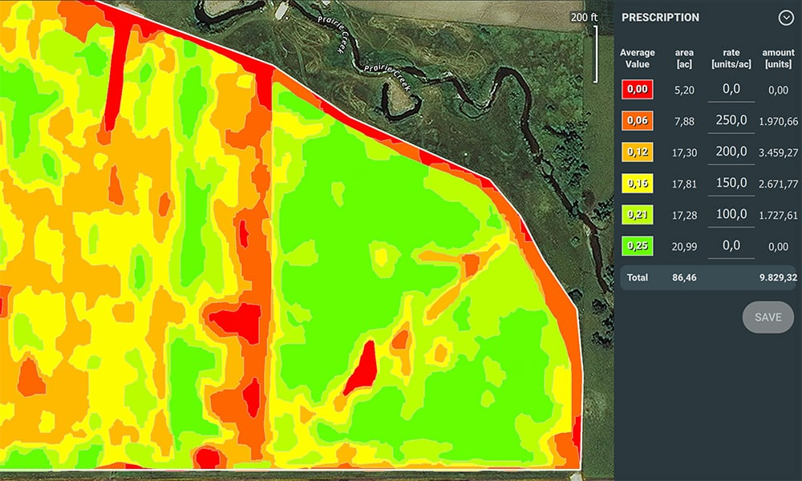
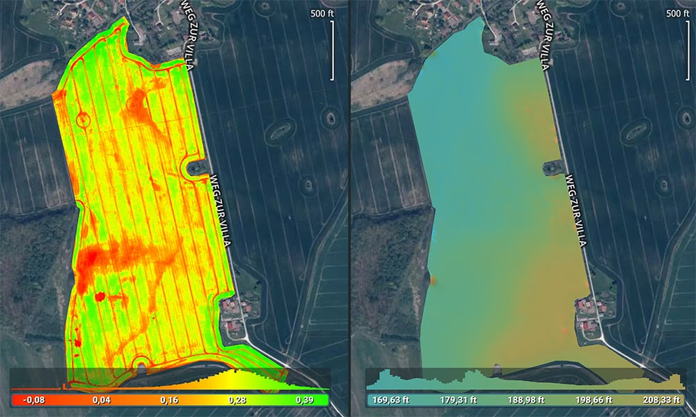
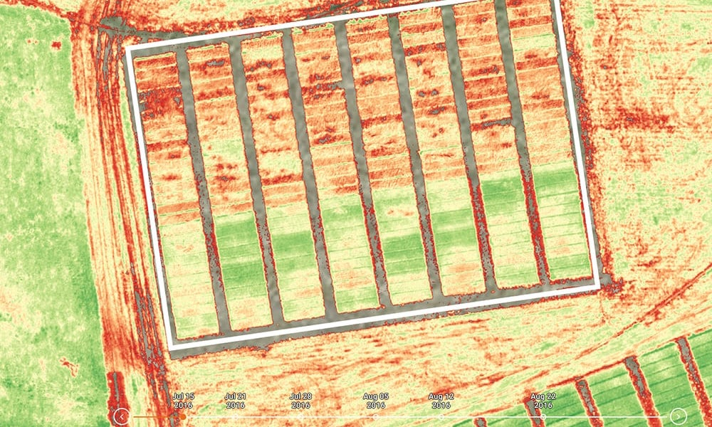
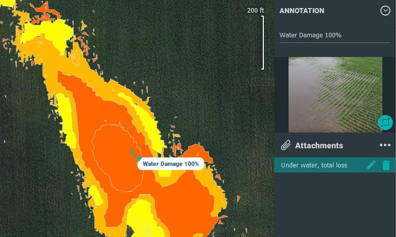
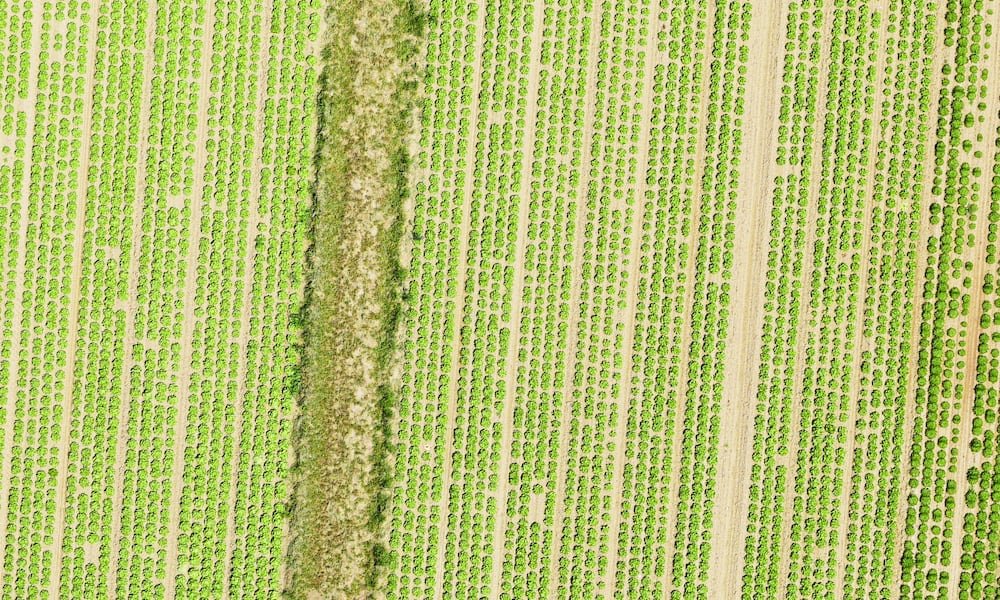

import { Link } from "gatsby"

<h4>Daha kısa sürede mahsul gelişimini izleme</h4>
Tarımsal dronlar, yetiştiricilere, hizmet sağlayıcılara ve tarım araştırmacılarına
mahsullerini keşfetmeleri, stresi belirlemeleri, tedavi planları oluşturmaları, bitki
büyümesini takip etmeleri ve çok daha fazlası için hızlı ve verimli bir yol sağlar.

WingtraOne gibi dronlar, yüksek çözünürlüklü RGB kameralar ve profesyonel multispektral sensörler kullanarak mahsul sağlığı sorunlarını erken tespit edip ölçebilir. Bu değerli bilgiler girdi maliyetlerini azaltabilir ve verimi artırabilir.

Drone'lardan alınan multispektral veriler çıplak gözle görülemeyen alan değişkenliğini ortaya çıkarır, bu da hastalıkları erken yakalamanıza, müdahale etmenize ve veriminizi artırmanıza yardımcı olur. Sağdaki resimde klorofil içeriğiyle ilgili bir bitki örtüsü indeksi gösterilmektedir. Kırmızı alanlar daha düşük klorofil değerleri anlamına gelirken, mavi alanlar daha yüksek değerler anlamına gelir.

<h2>Tarımda insansız hava araçlarının ve sensörlerin faydaları</h2>

<h4>Tarlalarınızı daha kısa sürede keşfedin</h4>

Dronlar, yaya olarak keşif yapmak için gereken sürenin çok daha azında bir alanın anlık görüntüsünü sağlar. Değişkenliği ve mahsul stresi alanlarını tespit etmeye ve tanımlamaya yardımcı olan verileri yakalayarak tek bir uçuşta yüzlerce hektarı kaplayın.

<h4>Kararları ve eylemleri yönlendiren kesin verileri yakalayın</h4>

Reçete haritaları ve planları oluşturmak için drone verilerini kullanın, tedavileri daha verimli bir şekilde odaklayın ve maliyetleri azaltın. Diğer tarımsal araçları tamamlayan bilgiler edinin. Örneğin, toprak / yaprak örneklemesi için, rastgele örnekleme yerine, drone verileri sizi örnekleme yapılacak en iyi yerlere yönlendirerek zamandan ve paradan tasarruf etmenizi sağlayabilir.

<h4>
  Araştırma veya üretim için bitkileri zaman içinde verimli bir şekilde takip
  edin
</h4>

Bitkilerin ortaya çıkışından hasata kadar nasıl ilerlediğini izleyin. Fenotipleme ve diğer araştırma uygulamaları için alanları doğru şekilde izleyin. Profesyonel multispektral sensörlerden kalibre edilmiş verilerin periyodik olarak yakalanması, aydınlatma değişiklikleri ne olursa olsun mahsul sağlığına ilişkin içgörüler sunarak, niceliksel eğilimleri türetmeniz için gereken verileri sağlar.

<h2>Ana uygulamalar</h2>

<h4>Mahsul izleme</h4>

Kaliteli bir drone ve multispektral kamera sistemi, hastalığı ve stresi erken tespit edebilir (bazen yerden veya standart renkli kameralarla görünmeden önce). Tedavi planlarınıza odaklanmak için bu bilgiyi kanıtlanmış agronomik yöntemlerle birlikte kullanın.

Erik ağacı bahçesinde klorozu tespit etmek. Kırmızılı ağaçlar, klorofil içeriğiyle bağlantılı bir indeks için daha düşük bir değere sahiptir.

Fitoftoradan (bir mantar hastalığı) etkilenen narenciye ağaçlarını bulmak. Bu multispektral görüntü, klorofilde eksik olabilecek alanları gösterir (daha düşük değerler kırmızı, daha yüksek değerler yeşil).

<h4>Reçete haritaları ve tedavi planları</h4>

Multispektral veriler, diğer yerleşik tarımsal yöntemlerle birleştirildiğinde, tedaviler (gübre, herbisit) için reçete haritalarını etkinleştiren, maliyetleri düşüren ve verimliliği artıran önemli bir araçtır.

Otomatik tohumlama için reçete haritaları da oluşturabilir

<h4>Sulama izleme ve planlama</h4>

Sulama ve drenaj yönetimi için drone haritalarını, dijital yüzey modellerini ve arazi modellerini kullanın. Multispektral veriler ayrıca sızdıran sulama borularını veya daha fazla suya ihtiyaç duyan alanları belirlemeye yardımcı olabilir.

Multispektral veya RGB görüntülerden alanların topografyası, drenaj ve sulama planlamasına rehberlik eder.

<h4>Hassas fenotipleme</h4>

Küçük test alanlarındaki performansı hızlı ve etkili bir şekilde ölçün ve izleyin. Değişen aydınlatma koşullarını açıklayan kalibre edilmiş veriler, zaman içindeki eğilimleri izlemenize olanak tanır.

Bir arpa araştırma sahasında fungisit tedavilerinin etkinliğinin ölçülmesi. Bitki örtüsü indeksi NDVI burada daha yüksek değerler (daha sağlıklı bitkiler) yeşil renkte gösterilerek gösterilmektedir.

<h4>Mahsul hasarı değerlendirmesi ve dokümantasyonu</h4>

Drone verileri, sel, yangın, zararlı böcekler, hava olayları vb. Nedeniyle mahsullere verilen zararı ölçmek ve belgelemek için kritik bilgiler sağlar. Bu raporlar sigorta taleplerini tamamlayabilir ve güçlendirebilir.

Sel hasar değerlendirmesi ve sigorta talebi için dokümantasyon.

<h4>Bitki sayımı ve mahsul çıkışı</h4>

Dronlardaki yüksek çözünürlüklü kameralar ve bitki sayma algoritmaları, envanter bilgilerini doğru ve verimli bir şekilde sağlayabilir, mahsulün ortaya çıkışını takip edebilir, yeniden dikim kararlarını yönlendirebilir ve verimi tahmin etmeye yardımcı olabilir.

<Link to="/posts" className="btn center-btn">
  tüm yazılar
</Link>
