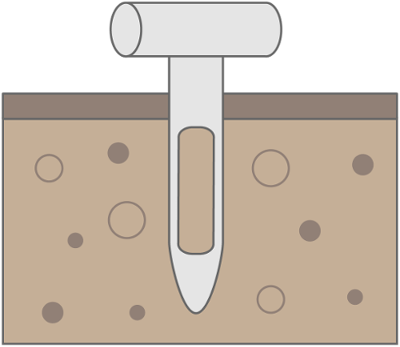

import { Link } from "gatsby"

<h4>
  Çeşitli ve engebeli arazileri kaplayabilme kabiliyetiyle, drone'lar hızla
  nihai hassas püskürtme aracı haline geliyor.
</h4>

Haritalama ile birleştirildiğinde, drone püskürtücüler, gübre ve toprak iyileştiricilerinin işlenmesinin gerekli olduğu belirli alanları hedeflemek, hastalıkları azaltmak ve hem süreçlerde hem de yeniden bitkilendirme sonuçlarında verimliliği artırmak için kullanılabilir. Hız ve gücün birleşimi, alanların manuel püskürtme işlemlerinden 40 kata kadar daha hızlı işlenebileceği anlamına gelir.

Akıllı uçuş kontrolü, dronun aşağıdaki alanı taramasına, gerçek zamanlı veri sağlamasına ve bitki örtüsünün üzerinde sabit ve doğru bir yükseklik tutmasını sağlar. Alt tabaka yükselip alçalsa bile püskürtme yoğunluğu korunur, böylece her zaman optimum miktarda gübre ve toprak iyileştirici uygulanır.

Her bir püskürtme memesi, doğrudan bir motorun altına yerleştirilir ve octocopters pervaneleri tarafından oluşturulan aşağı doğru hava akışının püskürtmeyi hızlandırarak erişimini artırmasını sağlar. Akıllı hafıza ile donatılmış olan drone, eski koordinatlarını hatırlayarak mevcut konumunu kaydeder, böylece yeniden doldurulduktan veya pil değiştirildikten sonra uçuşa kolayca devam edilebilir.

<h4>Ücretsiz toprak testinizi talep edin</h4>

Toprağın, herhangi bir yeniden bitkilendirme projesinin başarısının temeli olduğuna inanıyoruz, bu nedenle programlarımız her zaman sahada bulunan fiziksel, kimyasal ve biyolojik özelliklerin kapsamlı bir şekilde anlaşılmasına dayanmaktadır. Sonuçlar, olumlu bir büyüme ortamı sağlamak için hangi ayarlamaların yapılması gerektiğini belirlememiz için bize gerekli bilgileri sağlar. 100'ün üzerinde çeşitli iyileştiriciye erişim sayesinde, toprağın fiziksel ve mikrobiyolojik ortamının özelliklerini kolaylıkla iyileştirebiliyoruz. Projenizin ücretsiz programımıza uygun olup olmadığını görmek için uzman ekibimizle konuşun.

<Link to="/posts" className="btn center-btn">
  Tüm Yazılar
</Link>
