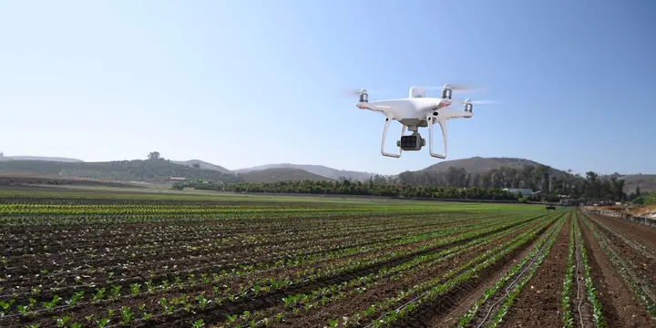
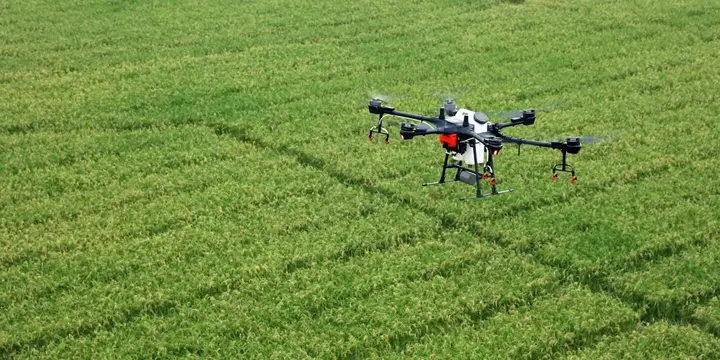

import { Link } from "gatsby"

<h4>Vizyoner Zeka. Yüksek Doğruluk.</h4>

En kompakt ve doğru alçak irtifa haritalama çözümü olan Phantom 4 RTK ile bir sonraki harita görevinizi yükseltin.

<h4>Hedeflenen Eylem için Bitki Zekası</h4>

Tarım görevleri, çevresel izleme ve daha fazlası için tasarlanmış sorunsuz entegre multispektral görüntüleme sistemine sahip yüksek hassasiyetli bir drone olan P4 Multispectral'ı kullanarak tesis düzeyinde hassas veriler toplayın.

<h4>Bitki Sağlığı Hakkında Anında İçgörüler Elde Edin</h4>

P4 Multispectral, mahsul sağlığı ve bitki örtüsü yönetimi hakkında fikir veren verileri yakalama sürecini birleştirir. DJI, bu platformu , OcuSync sistemi ile 27 dakika maksimum uçuş süresi ve 7 km 1'e kadar iletim aralığı dahil olmak üzere DJI'nin bildiği aynı güçlü performans standartlarıyla oluşturdu .

<h4>Yüzeyin Altına Bakın</h4>

Kutudan çıkar çıkmaz kapsamlı veri kümeleri toplayan yerleşik stabilize görüntüleme sistemiyle tarımsal görüntü toplama artık her zamankinden daha basit ve daha verimli. 1 RGB kamera ve Mavi, Yeşil, Kırmızı, Kırmızı Kenar ve Yakın Kızılötesi bantları kapsayan 5 kameralı multispektral kamera dizisi tarafından toplanan bilgilere erişin - tümü 3 eksenli stabilize gimbal üzerinde global deklanşörlü 2 MP'de.

<h4>Doğru Sonuçlar için Entegre Spektral Güneş Işığı Sensörü</h4>

Dronun tepesindeki entegre spektral güneş ışığı sensörü, günün farklı zamanlarında veri toplamanın doğruluğunu ve tutarlılığını en üst düzeye çıkaran güneş ışınımını yakalar. Sonradan işlenmiş verilerle birleştirildiğinde, bu bilgiler en doğru NDVI sonuçlarının elde edilmesine yardımcı olur.

<h4>Santimetre düzeyinde Hassasiyet</h4>

DJI'nin TimeSync sistemi ile altı kameranın tümü tarafından yakalanan görüntülerde santimetre düzeyinde doğru ölçümler sağlayan gerçek zamanlı, doğru konumlandırma verileri alın. TimeSync sistemi, uçuş kontrol cihazını, RGB ve NB kameraları ve RTK modülünü sürekli olarak hizalar, konumlandırma verilerini CMOS'un merkezine sabitler ve her fotoğrafın en doğru meta verileri kullanmasını sağlar. Tüm kameralar, radyal ve teğet lens bozulmalarının ölçüldüğü titiz bir kalibrasyon sürecinden geçer. Toplanan bozulma parametreleri her görüntünün meta verilerine kaydedilir ve işlem sonrası yazılımın her kullanıcı için benzersiz şekilde ayarlanmasına izin verir.

<h4>D-RTK 2 Mobil İstasyon ve NTRIP Uyumluluğu</h4>

P4 Multispectral'ı D-RTK 2 Yüksek Hassasiyetli GNSS Mobil İstasyonuna ve NTRIP'e (İnternet Protokolü aracılığıyla RTCM'nin Ağ Aktarımı) 2 bağlayarak internet bağlantısı olmadan RTK konumlandırmasının doğruluğunu artırın veya İşlem Sonrası için kullanılacak uydu gözlem verilerini depolayın Kinematik (PPK).

<h2>Akıllı Tarım Uygulama Aşamaları</h2>

<h4>Uçuş Planlama</h4>

PHANTOM 4 RTK ile birlikte DJI'nin lider uçuş planlama iOS uygulaması olan GS PRO'yu kullanarak uçuşları planlayın, otomatik görevleri gerçekleştirin ve uçuş verilerini yönetin.

<h4>Veri Yakala</h4>

P4 Multispectral kullanarak geniş bir alanda çok bantlı görüntüleri verimli bir şekilde toplayın ve sorunlu alanlara genel bir bakış elde edin.

<h4>Veri analizi</h4>

Bitki sağlığı üzerinde istenen sonuçları elde etmek için tesise özgü ölçüm ve parametreleri uygulayarak hava verilerine kolayca erişin ve işleyin.

<h4>Verilere göre hareket et</h4>

Doğru drone verilerine dayalı olarak dikkat edilmesi gereken alanlarda hedefli tedaviler uygulayın.

<Link to="/posts" className="btn center-btn">
  Tüm Yazılar
</Link>
