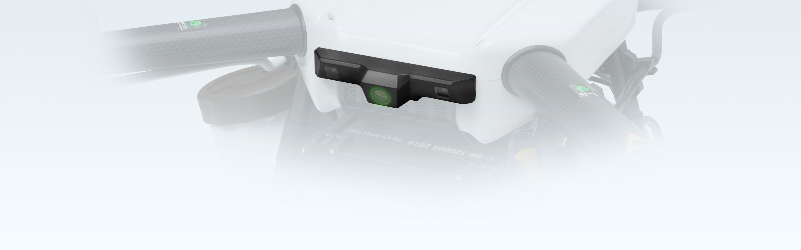
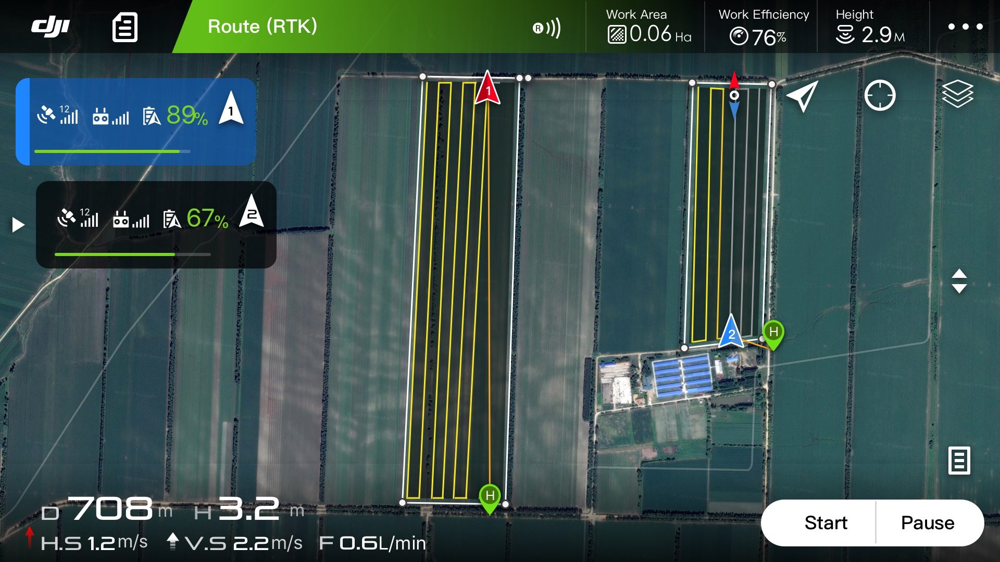

import { Link } from "gatsby"
import { RegVideo, Video } from "../../components/Complete"

<h2>Çoklu Uçak Kontrol Modu</h2>

<h4>İki Kat Verimlilik ve Kontrol Aralığı</h4>

Tek bir MG-1P kontrolörü, beş adede kadar MG-1P uçağını aynı anda kontrol ederek tek pilotlu operasyonların verimliliğini ikiye katlayabilir. Bu yeni akıllı uzaktan kumanda, kontrol menzilini 3 km'ye [1] kadar genişletir ve yüksek çözünürlüklü video iletimini destekler Yeni uzaktan kumanda ayrıca 4G kablosuz iletişimi, değiştirilebilir bir bataryayı ve yeni anten tasarımını destekleyerek günlük operasyonlar için daha da fazla kolaylık sağlıyor.

<h4>İki Kat Verimlilik ve Kontrol Aralığı</h4>

MG-1P serisi dronlar, net, öne bakan canlı görüntüler ileten 123 (santigrat derece) FOV geniş açılı kameralarla donatılmıştır. Uzun mesafeli kullanım için, uzaktan kumandaların yerleşik ekranı, güvenliği sağlamak için engellerden kaçınma bilgilerini gösterir. FPV kamera beslemesinin yardımıyla, kullanıcılar A / B noktalarını veya ara noktaları zahmetsizce kaydedebilir, bu da iş doğruluğunu ve verimliliğini artırabilir.

<Video src="https://www.youtube.com/embed/IH_kGijV8so" />

<h4>Yükseltilmiş Yüksek Hassasiyetli Radar Kapsamlı Güvenlik</h4>

MG-1P'nin geliştirilmiş radar sistemi, önceki MG-1S uçaklarından alınan üç yüksek hassasiyetli arazi algılama radarını bir engelden kaçınma radarı ile bütünleştirir. Bu, algılama hassasiyetini ikiye katlar ve çok yönlü algılamaya olanak tanır, [2] uçakların engelleri algılama ve araziyi otomatik olarak takip etme becerisini önemli ölçüde artırır. MG-1P, 15 m mesafeye kadar santimetre genişliğindeki güç hatlarını algılayabilir. Bu, uçağı yalnızca güç hatlarından değil, ağaç dallarından ve diğer yaygın engellerden de korur. Aktif Engel Algılama ve Önleme, ışık veya tozdan etkilenmeden gündüz veya gece çalışır. Ayrıca, radar sistemleri Giriş Koruma derecesi IP67'ye yükseltildi

<h4>Pratik ve Güçlü Çalışma Modları</h4>

MG app v2.0'a yeni çalışma modları eklendi. Multi-Aircraft Control modu kolay ve sezgiseldir, kullanıcıları tek bir uzaktan kumanda ile birden fazla uçağı kontrol etme yetkisi verir. Diğer bir yeni çalışma modu, optimize edilmiş uçuş rotalarını kullanan ve çalışma verimliliğini% 20'ye kadar artıran Banked Turning'dir. Yeni modların yanı sıra, AB Rotası Çalıştırma Modu, Manuel Çalıştırma Modu ve Manuel Plus Çalıştırma Modu, çok sayıda kontrol seçeneğine izin vermek için hala kullanılabilir.

<Link to="/posts" className="btn center-btn">
  Tüm Yazılar
</Link>
